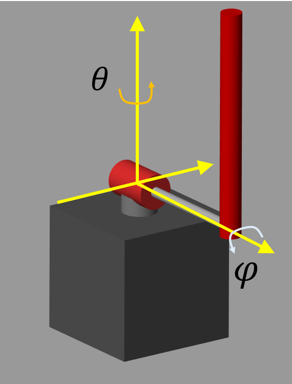

# Design inverted pendulum with PID controller
# Initialize

```matlab:Code
clear; clc;
SIMULATION_MODE = 0;    % 0:Simulation  1:Experiment

ctrlName = 'PID_controller';

if (SIMULATION_MODE == 1)
    clean_cache_folder(currentProject);    
end

```


```matlab:Code
% Initial angle and angular speed.
theta0   = 0/180*pi;
phi0     = 160/180*pi;
dtheta0  = 0;
dphi0    = 0;

% Angle reference for the pendulum
ref_angle = pi;
```

# Plant Model


Define angles as below.





 is the rotator arm angle,  is the pendulum angle.


The rotator arm angle is  when the arm is looking forward. Counter‐clockwise is positive.


The pendulum angle is  when the pendulum is looking under. Counter‐clockwise is positive.


 when the pendulum is inverted.


Input of the plant model is DC voltage input for the DC motor. The DC motor rotates the arm because the torque is generated. The system is 1 input, 2 output, and 4 states. This is so-called underactuated system.


, , 


The plant model is modeled with Simscape. (Refer to "pendulumLib.slx").


# Define Plant Parameters


Plant parameters are identified and tuned to match the real dynamics.


```matlab:Code
plant_parameters;
```

# Design Controller


The controller is designed in "PID_controller.slx".


```matlab:Code
open_system('PID_controller');
```


The controller feedbacks the rotator arm angle, angular speed, pendulum angle, and angular speed. Gains are multiplied to each, and calculates the manipulated variable. 


The controller is a combination of rotator control and pendulum control. The manipulated variable of rotator control is used as the reference angle of pendulum control. The references of arm angle, angular speed, and pendulum angular speed are always 0.


When the pendulum angle is under 90[deg], The gains of pendulum angle and angular speed is inverted. Then it can keep the pendulum steady. In this case, the reference of pendulum angle must be 0.


# Simulation


The control system is modeled in "ClosedLoopSystem_PID.slx". Check how the controller works with the plant model. And "ClosedLoopSystem_PID_Exp.slx" is for experiment with Raspberry Pi and QUBE - Servo 2 hardware. Connect them before running the model.


```matlab:Code
theta_gain   = 0.162;
dtheta_gain  = 0.0356;
phi_gain     = 40;
dphi_gain    = 2;

load_system(ctrlName);
if (SIMULATION_MODE == 1)
    open_system('ClosedLoopSystem_PID_Exp');
    setActiveConfigSet(ctrlName, 'Config_raspi');
    save_system('ClosedLoopSystem_PID_Exp', [], ...
        'SaveDirtyReferencedModels', true);
else
    open_system('ClosedLoopSystem_PID');
    setActiveConfigSet(ctrlName, 'Config_sim');
    save_system('ClosedLoopSystem_PID', [], ...
        'SaveDirtyReferencedModels', true);
end

```

  


* Copyright 2021 The MathWorks, Inc.*


