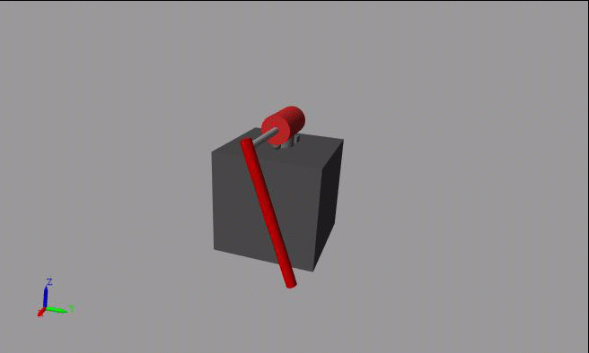

# 深層強化学習が苦手とする動作について
# 【注】

本ドキュメントに記載されている事柄は、数学的に証明されたものではなく、「経験則に基づく傾向」である。また、これは MathWorks の公式な見解ではなく、著者個人の見解である点に注意すること。

# 連続と離散

強化学習は、ある決まったルールの中で、限定された行動範囲の中で最適な行動選択をする方策を学習するアルゴリズムである。強化学習の理論は、環境のダイナミクスがマルコフ決定過程（Markov decision process: MDP）に従っていると仮定して作られている。

従って、外乱が発生せず、とりうる状態や行動のパターンや組み合わせが有限であるシステムに対しては、理論通りの学習結果を得ることは容易である。ここで、とりうる状態や行動のパターンや組み合わせが有限であることを「離散」、無限であることを「連続」と呼ぶ。

一方で、強化学習が「連続」のシステムを扱えるようするために、離散から連続に理論の式を近似している。「連続」のシステムでは、以下の点を考慮しなければならないため、「離散」のシステムよりも難しくなる。

   -  離散から連続に理論の式を近似しているが、その近似が妥当でない場合が存在する 
   -  現実的には、物理モデリングにおいて、完全に環境のダイナミクスを再現することはできないため、マルコフ決定過程に従ったシステムであると仮定しても、考慮していない動特性により、その仮定に反した動作をする場合がある 

今回の倒立振子のシステムでは、角度や角速度、電圧などは物理量であるため、実数で表現される。実数の取りうるパターンは無限であるため、状態と行動は、共に「連続」である。システムはDCモーターと振り子のマルチボディで構成されているが、例えば、PWMの応答の遅れや空気抵抗力の影響はモデル化していない。

# 局所解

システムの構造やダイナミクスと報酬関数の組み合わせによって、局所解に陥り、それ以上に報酬を大きくすることができなくなる場合がある。これは、そのシステムにおいて達成したいタスクが複雑であるほど発生しやすい。今回の倒立振子のシステムでは、DCモーターが一方向に回転し続けるという局所解が多く見られた。

  

> Fig.1 倒立振子の局所解の例（DCモーターが一方向に回転し続ける）

  

局所解に陥らないようにするためには、局所解に至らないように報酬関数を設計する必要がある。陥る理由を理解し、トライ\&エラーで報酬関数を修正していく工程が必要となる。

# 深層ネットワークのランダム性

高い制御性や自律性を獲得できると期待されているのは、従来の強化学習アルゴリズムではなく、深層ニューラルネットワークを価値関数や方策に用いた「深層強化学習」である。深層ニューラルネットワークは、その高い表現力により、あらゆる非線形の関数を近似することができる。

しかし、その一方で、「一様な結果」を出力する関数を学習することが苦手である。もちろん、一様な結果を出力する関数は、深層ニューラルネットワークで構築することができる。しかし、その関数を学習して導き出すことが、現在の深層強化学習アルゴリズムでは難しいのである、と予想される。

今回の倒立振子のシステムでは、例えば振り子の角度が180[deg]であり、DCモーターの角度が30[deg]であった場合、振り子の角度を180[deg]近くに維持したまま、DCモーターの角度を0[deg]に戻るようにしたい。もちろん、DCモーターの角度が何度であれ、0[deg]に戻す、という要件は同一である。

  

> Fig.2 DCモーター角度を0[deg]にする制御

  

この時、振り子の角度は常に180[deg]付近に維持する必要があり、それはDCモーターの角度に依存して変化してはいけない。そもそも振り子の回転運動は、DCモーターの角度とは独立しているため、この振り子の角度を180[deg]に維持することは容易に実現可能である。例えば、従来の制御理論を用いれば、振り子の角度と角速度から必要な操作量を計算して与えることで実現できる。

しかし、この動作を深層ニューラルネットワークで実現させることは難しい。この動作を行うためには、「振り子の角度が180[deg]近辺にあるとき、DCモーターの角度に依存した操作量を出力しない」ネットワーク構造になっていなければならない。つまり、DCモーターの角度として何を入力しても、「一様な結果」を出力する、ということである。

全結合層を何層も重ねた構造である深層ネットワークは、一つの入力値がほぼ全ての層のノードに伝搬する構造になっている。これは予想であるが、この広範な伝搬を全て制御し、出力層に全く影響させないことができるネットワークの重みは希少であり、現在の学習アルゴリズムでは、それを発見することが容易ではないと考えられる。

  

> Fig.3 深層ニューラルネットワークの入力値伝搬

  

このような「一様な結果」が求められるシステムは、制御設計の場面では頻繁に現れる。従って、この点を考慮せずに深層強化学習を設計しても、目的を達成することはしばしば困難となる。

「一様な結果」を達成することは、「離散」よりも「連続」のシステムの方が難しい。また、「離散」のシステムでも、行動のパターン数が多いほど難しくなる。一方で、最も少ないパターン、例えば On と Off などであれば、「一様な結果」は達成できる可能性がある。

  

* Copyright 2021 The MathWorks, Inc.*

