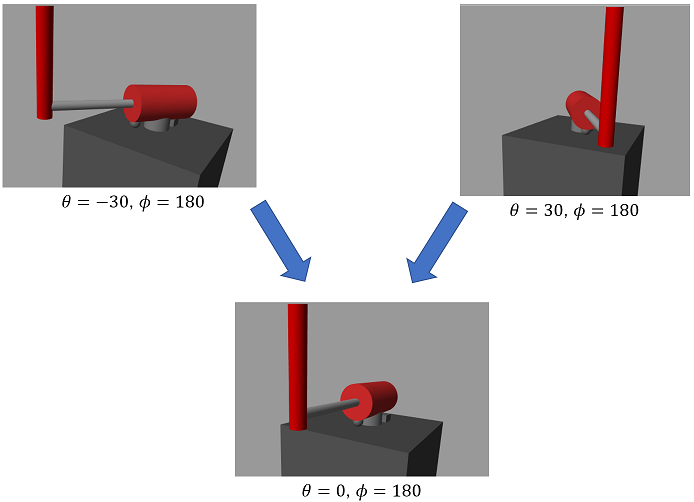
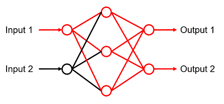

# What task is difficult for Deep Reinforcement Learning?
# Note

The information in this document is not proved mathematically, but is an "empirical trend". And note that this is not the official view of MathWorks, but the personal view of the author.

# Continuous and Discrete

Reinforcement Learning is an algorithm that learns how to select the best action within a limited range of actions within a certain set of rules. The theory of Reinforcement Learning is based on the assumption that the dynamics of the environment follows a Markov Decision Process (MDP).

Therefore, it is easy to learn and get good results from a system in which there are no disturbances and the number of combinations of states and actions are finite. Here, the finite number of states and actions is called "discrete," and if it is infinite, called "continuous".

On the other hand, in order for Reinforcement Learning to be able to handle "continuous" systems, the theoretical formulas are approximated from discrete to continuous. "continuous" system is more difficult than a "discrete" system because the following points have to be taken into account.

   -  The formulas are approximated, but there are cases where the approximation is not enough. 
   -  Practically speaking, physical modeling cannot perfectly reproduce the dynamics of the environment. Even if a system is assumed to follow a Markov decision process, it may behave contrary to the assumption due to dynamic properties that are not taken into account. 

In this inverted pendulum system, angles, angular velocities, and voltages are physical quantities. So they are represented by real numbers. Since the possible patterns of real numbers are infinite, the states and actions are both "continuous". The system consists of a DC motors and a pendulum multi-body, but for example, the effects of delayed response of PWM and aerodynamic drag are not modeled.

# Local Optima

Depending on the structure and dynamics of the system in combination with the reward function, it sometimes falls into a local optima and cannot increase the reward any further. This is more likely to happen when the task to be accomplished in the system is more complex. In this inverted pendulum system, local optima "DC motor keeps rotating in one direction" happened frequently.

  

> Fig.1 One local optima of the inverted pendulum. (DC motor keeps rotating in one direction)

  

In order to avoid falling into local optima, it is necessary to design the reward function properly. The process of understanding the reasons for falling into the trap and modifying the reward function through trial and error is necessary.

# Randomness of deep networks

"Deep Reinforcement Learning" is expected for a high control performance� and autonomy, rather than traditional one. "Deep Reinforcement Learning" uses deep neural networks for value functions and policies. Deep neural networks can approximate any nonlinear function due to their high expressive power.

However, on the other hand, it is not good at learning functions that output "uniform results". Of course, a deep neural network can be a function that outputs a uniform result. However, it is predicted that learning and deriving such a function is difficult in current deep reinforcement learning algorithms.

In this inverted pendulum system, for example, if the angle of the pendulum is 180[deg] and the angle of the DC motor is 30[deg], the angle of the pendulum should be near 180[deg] while the angle of the DC motor is returning to 0[deg]. Of course, no matter what the angle of the DC motor is, the angle should return to 0[deg].

  

> Fig.2 Control to set the angle of the DC motor to 0[deg].

  

At this time, the angle of the pendulum must always be around 180[deg], and it must not change depending on the angle of the DC motor. Since the rotation of the pendulum is independent from the angle of the DC motor, it is easily to maintain this around 180[deg]. For example, using the conventional control theory, it can be achieved by calculating and giving the manipulated variable from the angle and angular velocity of the pendulum.

However, it is difficult to realize this operation with a deep neural network. In order to achieve this, the network structure must be such that "when the angle of the pendulum is around 180[deg], it does not output the manipulated variable depending on the angle of the DC motor. In other words, no matter what the angle of the DC motor is, the output must be "uniform results".

A deep network, which is a structure of many layers such as fully connected layers, has a structure in which a single input value propagates to almost all nodes in the layers. It is assumed that there are few network that can control all this extensive propagation and never affect the output layer. And it is not easy to find them with current learning algorithms.

  

> Fig.3 Input value propagation in deep neural networks.

  

Systems that requires "uniform results" frequently appears when designing control systems. Therefore, designing Deep Reinforcement Learning will be difficult without considering this point of view.

Achieving a "uniform result" is more difficult in a "continuous" system than "discrete". Even in a "discrete" system, the greater the number of action pattern, the more difficult to achieve. On the other hand, if it has the fewest action pattern, such as On and Off, "uniform result" may be achievable.

  

* Copyright 2021 The MathWorks, Inc.*

